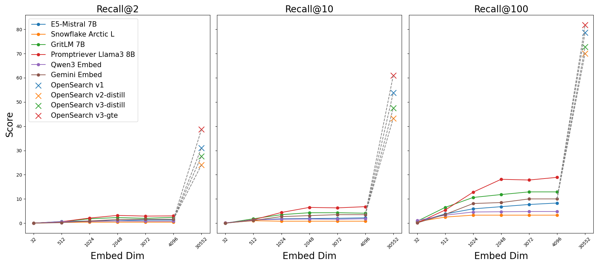
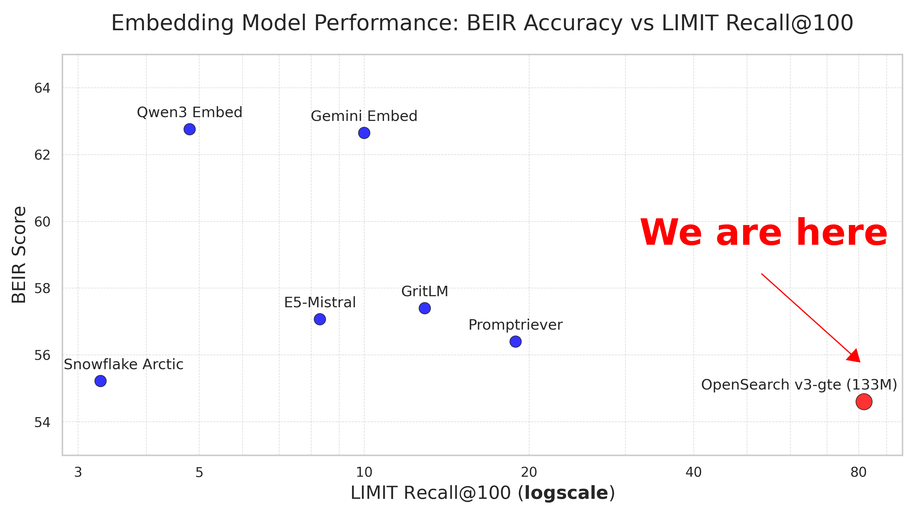

# LIMIT-Inference-free Sparse Embedding Experiments

This repo contains scripts to evaluate state-of-the-art sparse embedding models from OpenSearch on the LIMIT dataset (`limit-small` and `limit`) from google's paper [On the Theoretical Limitations of Embedding-Based Retrieval](https://arxiv.org/abs/2508.21038).

As the use of sparse embedding models presents a promising direction in addressing the theoretical limitations of dense embeddings (due to the limited embedding dimensions), this repository aims to provide evaluation scripts to demonstrate how well the current best sparse embedding models from OpenSearch perform on the LIMIT dataset. Note all following experiments are **zero-shot**, i.e., no fine-tuning is performed on the LIMIT dataset.


<!--  -->

## Environment Setup
We recommend using `uv` to manage the Python environment. To set up the environment, run the following commands:

```bash
uv pip install -r requirements.txt
```
Instead, these are the main packages we used:
```bash
uv pip install sentence-transformers beir tqdm
```

## Running the Experiments

To run the experiments for all models, execute the following command from the root directory of the project:

```bash
bash scripts/run_experiments.sh
```

This will run the `sparse_embedding.py` script for each model specified in the `run_experiments.sh` file and save the output to a log file in the `code` directory.

## Results

### limit-small Dataset
For simplicity, we omitted the prefix `opensearch-neural-sparse-encoding-doc-` in the model names.

| Model                                                             | NDCG@10 | Recall@2 | Recall@10 | Recall@20 | Recall@100 | Corpus Encoding Time (s) | Query Encoding Time (s) |
| ----------------------------------------------------------------- | ------- | -------- | --------- | --------- | ---------- | ------------------------ | ----------------------- |
| [v1 (133M)](https://huggingface.co/opensearch-project/opensearch-neural-sparse-encoding-doc-v1)                          | 0.9516  | 0.9065   | 0.9780    | 0.9875    | 1.0000     | 0.3279                   | 0.2182                  |
| [v2-distill (67M)](https://huggingface.co/opensearch-project/opensearch-neural-sparse-encoding-doc-v2-distill)                    | 0.8991  | 0.8170   | 0.9530    | 0.9735    | 1.0000     | 0.2858                   | 0.2223                  |
| [v3-distill (67M)](https://huggingface.co/opensearch-project/opensearch-neural-sparse-encoding-doc-v3-distill)                | 0.9191  | 0.8420   | 0.9705    | 0.9835    | 1.0000     | 0.2816                   | 0.2097                  |
| [v3-gte (133M)](https://huggingface.co/opensearch-project/opensearch-neural-sparse-encoding-doc-v3-gte)                        | 0.9591  | 0.9235   | 0.9855    | 0.9920    | 1.0000     | 0.3652                   | 0.2208                  |

### limit Dataset

| Model                                                             | NDCG@10 | Recall@2 | Recall@10 | Recall@20 | Recall@100 | Corpus Encoding Time (s) | Query Encoding Time (s) |
| ----------------------------------------------------------------- | ------- | -------- | --------- | --------- | ---------- | ------------------------ | ----------------------- |
| [v1 (133M)](https://huggingface.co/opensearch-project/opensearch-neural-sparse-encoding-doc-v1)                          | 0.4240  | 0.3105   | 0.5375    | 0.6295    | 0.7865     | 138.1581                 | 0.1946                  |
| [v2-distill (67M)](https://huggingface.co/opensearch-project/opensearch-neural-sparse-encoding-doc-v2-distill)                       | 0.3391  | 0.2405   | 0.4330    | 0.5215    | 0.7000     | 89.9987                  | 0.1937                  |
| [v3-distill (67M)](https://huggingface.co/opensearch-project/opensearch-neural-sparse-encoding-doc-v3-distill)                  | 0.3774  | 0.2760   | 0.4750    | 0.5610    | 0.7270     | 91.5061                  | 0.1912                  |
| [v3-gte (133M)](https://huggingface.co/opensearch-project/opensearch-neural-sparse-encoding-doc-v3-gte)                        | 0.5000  | 0.3870   | 0.6090    | 0.6920    | 0.8180     | 169.7157                 | 0.1943                  |

Our experiment platform is a machine with 1 NVIDIA A100 GPU.

## Cite
If you use this code for your research, please cite the following paper:

```
@misc{weller2025theoreticallimit,
      title={On the Theoretical Limitations of Embedding-Based Retrieval}, 
      author={Orion Weller and Michael Boratko and Iftekhar Naim and Jinhyuk Lee},
      year={2025},
      eprint={2508.21038},
      archivePrefix={arXiv},
      primaryClass={cs.IR},
      url={https://arxiv.org/abs/2508.21038}, 
}

@inproceedings{Shen_2025, series={SIGIR ’25},
   title={Exploring $\ell_0$ parsification for Inference-free Sparse Retrievers},
   url={http://dx.doi.org/10.1145/3726302.3730192},
   DOI={10.1145/3726302.3730192},
   booktitle={Proceedings of the 48th International ACM SIGIR Conference on Research and Development in Information Retrieval},
   publisher={ACM},
   author={Shen, Xinjie and Geng, Zhichao and Yang, Yang},
   year={2025},
   month=jul, pages={2572–2576},
   collection={SIGIR ’25} 
}

@misc{geng2025competitivesearchrelevanceinferencefree,
      title={Towards Competitive Search Relevance For Inference-Free Learned Sparse Retrievers}, 
      author={Zhichao Geng and Yiwen Wang and Dongyu Ru and Yang Yang},
      year={2025},
      eprint={2411.04403},
      archivePrefix={arXiv},
      primaryClass={cs.IR},
      url={https://arxiv.org/abs/2411.04403}, 
}
```